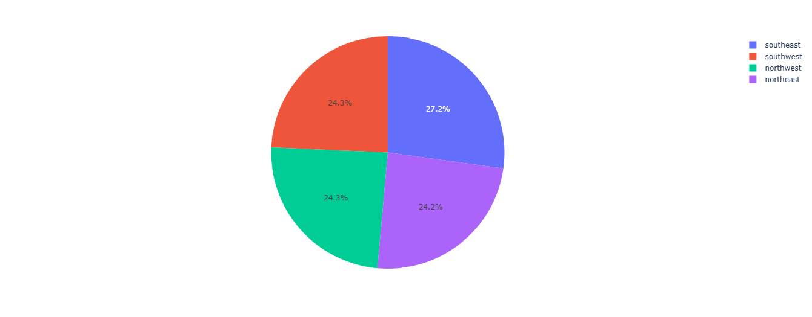
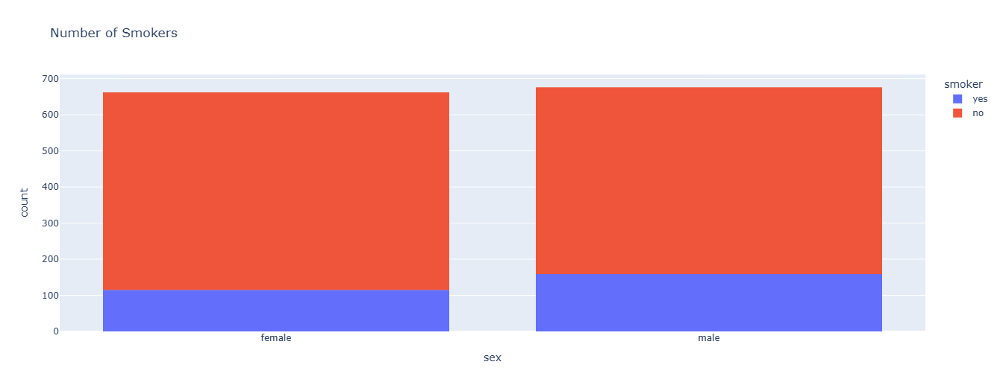
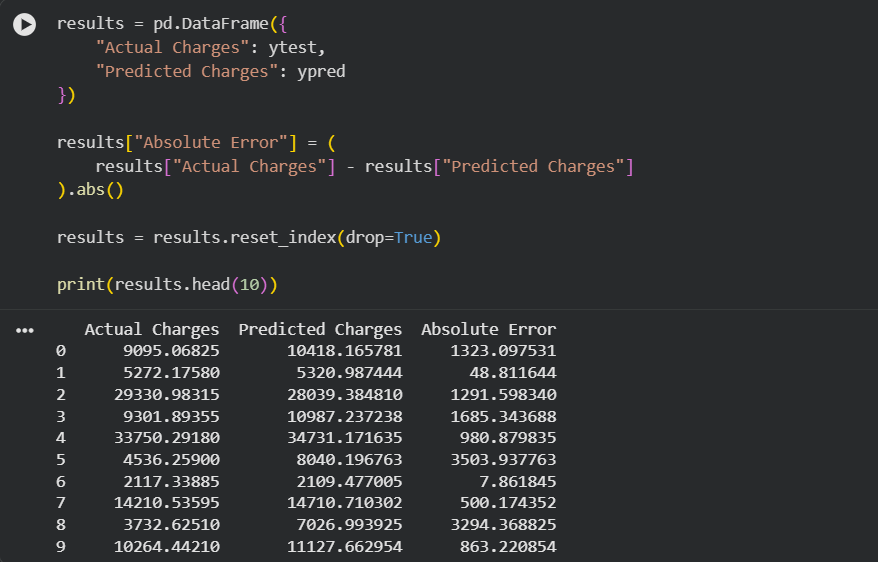
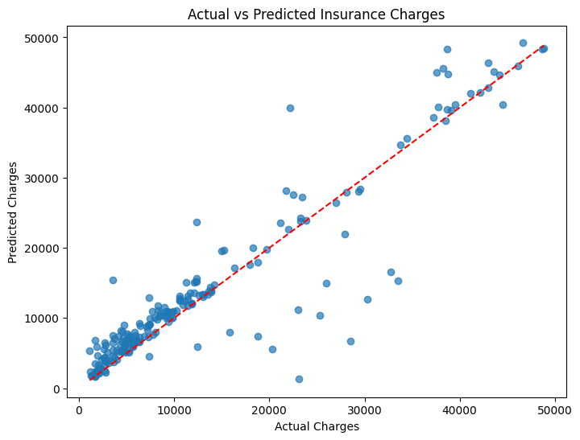

# Health Insurance Premium Prediction

This project predicts health insurance premium charges using Machine Learning. Using 6 different features to train a model to make predictions on a target variable i.e. Charges.

## Dataset
Health Insurance Dataset

## Algorithms
- Random Forest Regressor

## Libraries
- Pandas
- NumPy
- Scikit-learn
- Plotly
- Matplotlib

## Piechart showing Smokers by Region

## Smoker Histogram

## Actual vs Predicted Charges

## Actual vs Predicted Charges Plot

## Performance

R² Score : 0.84

MAE : 2738

RMSE : 4957

MAPE : 33%

## Features

- Age
- Gender
- BMI
- Children
- Smoker
- Region

## Target Variable
- Charges

## Author

Rahul Garg
